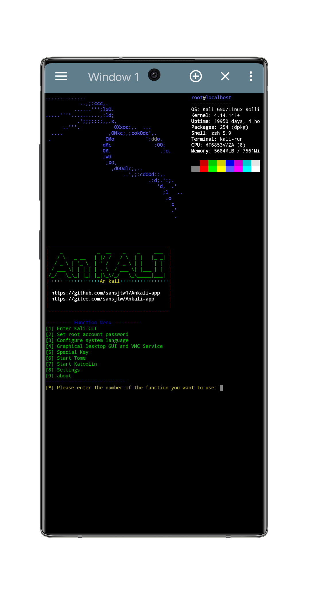

# AnKali APP

Ankali App是一种利用Proot在Android设备上创建隔离的“chroot”环境而无需Root的工具，他可以让你在非Linux环境中运行Kali Linux环境。



## 软件信息

Ankali不依赖其他应用程序，如Termux。因为他自己就是一个Android终端模拟器应用程序

包名:com.kalinr

最小SDK:14

目标SDK:28

## 下载Ankali APK
[Google drive](https://drive.google.com/drive/folders/1REO9a_jtFE65XNc5nu0sY4mTp_pVH5Qh?usp=drive_link)

[GitHub Download](https://github.com/sansjtw1/Ankali-app/releases)

[123pan](https://www.123pan.com/s/QSZRVv-rGH43)

[baidupan](https://pan.baidu.com/s/1m6pYDJavd45Cler6B9DkbA ) 提取码:1234

## 关于应用程序源码

你想知道app源码？该程序其实只是运行在TermOne Plus中的脚本，我们仓库只存储脚本文件和配置文件的逻辑文件。
**TermOne Plus官方网站**: https://termoneplus.com/

**TermOne Plus开源仓库Gitlab**: https://gitlab.com/termapps/termoneplus/

>"TermOne Plus" is an Android application that turns your Android device into an computer terminal. It is useful for accessing the command line shell (built into every Android phone) or use custom one (installed separately).


## 使用须知

1. **预留内存**: 此应用程序初次使用会解压kali镜像文件，解压后大约占用2G手机存储。请保证你的设备拥有足够的内存甚至更多。

2. **关于隐私**: 该程序不会收集用户的任何个人信息，但是程序的第三方软件包可能另外。更多信息可以查看仓库的《隐私条约》。

3. **使用门槛**: 适配于Android版本7.0及以上最佳可能是Android11，如果你的Android版本较低和过高或者不支持你的设备可能导致包括但不限于`软件闪退`、`无法解压`、`软件包无法使用`、`系统命令无法使用`，请确保你的设备支持该APP。

4. **无需Root**: 软件使用Proot模拟运行kali环境，是不需要Proot的。
>PRoot is a user-space implementation of chroot, mount --bind, and binfmt_misc. This means that users don't need any privileges or setup to do things like using an arbitrary directory as the new root filesystem, making files accessible somewhere else in the filesystem hierarchy, or executing programs built for another CPU architecture transparently through QEMU user-mode. Also, developers can use PRoot as a generic Linux process instrumentation engine thanks to its extension mechanism, see CARE for an example. Technically PRoot relies on ptrace, an unprivileged system-call available in every Linux kernel.

5. **问题反馈**: 有任何的问题和反馈，可以在Github上提出它。

## 参考与引用

**应用图标取自于**: [Wikimedia Commons File:Kali-dragon-icon.svg](https://commons.m.wikimedia.org/wiki/File:Kali-dragon-icon.svg)

**Android终端模拟器基于**: [TermOne Plus](https://termoneplus.com/)

**引用了Tome部分文件**: [Tome](https://github.com/2moe/tmoe)

**Proot预编译程序**: [build-proot-android](https://github.com/green-green-avk/build-proot-android)

## Ankali调试模式 Debug Mode

在容器外使用命令启动调试菜单:
```
kali-test
```
功能:

1.***Backup kali-arm64***: 可帮助你将镜像文件`kali-arm64`重新压缩打包至`kali-arm64.tar.xz`。打包后建议直接移动至本地其他文件夹，否则当应用重启时会进行解压操作。

2.***Download kali-arm64 from GitHub***: 可帮助你用于镜像文件出现损坏或者需要重置的。使用此功能请确保网络流畅和内存充足的情况下，程序会自动帮助你解压他。

3.***Reset configuration file***: 可帮助你将Ankali对你的配置进行重置（仅仅是对配置文件，而不是kali linux系统配置文件)

4.***Start kali linux***: 可帮助你启动容器。

5.***Start Xonsh***: 可帮助你使用容器外的终端。

## 更多反馈
也许Wiki上有你的问题，你可以去看看:
https://github.com/sansjtw1/Ankali-app/wiki

你可以直接在Github的issue上询问你的问题，也可以通过我的电子邮箱联系我:
- sansjtw@163.com
- sansjtw1@gmail.com